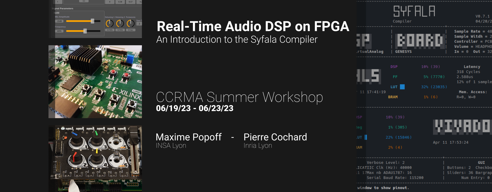

# Real-Time Audio DSP on FPGA

Have you ever wanted to take your **embedded audio DSP projects** to the next level?

Imagine being able to benefit from *unparalleled audio latency performances* and *computational power*, all while using an *accessible programming language*. Or maybe you just want to be able to use a *huge number of microphones and speakers* with ultra-fast audio processing?

Well, you're in luck! Come discover **[Syfala](https://github.com/inria-emeraude/syfala)**: the first open-source audio DSP compiler targeting **FPGAs** using the **[Faust programming language](https://faust.grame.fr/)**.

We'll cover everything from the basics of FPGA programming to the  syntax and concepts to use Faust on an embedded platform. We'll show you how to create your own Faust DSP for real time audio processing, and  control it with a baremetal system or an embedded Linux.

So come join us for this **hands-on workshop**! Let's explore the world of FPGAs together and see what amazing audio processing capabilities we can create!

## Description

*Field-Programmable Gate Arrays* (FPGAs) provide unparalleled **audio latency** and **computational power**. This makes them a better fit for real-time audio processing than traditional CPUs for many applications.

These embedded platforms can easily handle DSPs with *thousand of channels* while guaranteeing *very low latency*. You can imagine some very advanced applications in *spatial audio, noise cancelling or active control of room acoustics*. For exemple, the combination of a large number of microphones and  speakers with ultra-fast audio processing could permit to actively  modify the acoustical properties of rehearsal spaces, concert halls,  etc., to make them sound like a cathedral or any famous venue in the  world.

It also provides opportunities for new *musical discoveries and investigations*, like using very high audio sampling rate to generate digital oscillator, approximating analog.

However, programming them is very **complex** and out of reach to non-specialized engineers as well as to most people in the audio community. That's where **Faust** comes to the rescue!

**Faust** is a *functional programming language*  for sound synthesis and audio processing with a strong focus on the  design of synthesizers, musical instruments, audio effects, etc.

**Programming FPGAs with Faust** will allow you to explore the power of FPGAs while leveraging an *accessible programming language* that's widely used within the audio community.

Using a **Zybo ARM/FPGA SoC Development Board** which  can be provided to you as part of a lab kit, you will learn how to  easily program your own Faust audio signal processing applications on an embedded Linux environment offering the unmatched performances of an  FPGA.

## Covered topics

During this course, as an introduction to FPGAs, we will first describe in details **the ins and outs of this platform**: how they work, their general purpose, and why they are a great fit for audio hardware and software development.

We will dive in audio development on FPGAs using Syfala to **compile our first baremetal audio programs from regular Faust DSP code**. We will then generate a graphical user interface (GUI) to control it in real-time.

Finally, we will demonstrate how to **build and use a custom-made embedded Linux distribution directly on the board**. This will allow us to use more advanced control protocols such as **MIDI**, Open Sound Control (**OSC**), **HTTP**, etc.

By the end of the workshop, you should have a good understanding of  the possibilities that such a platform affords in the context of  real-time audio processing.

## Instructors

- [Maxime Popoff](https://profiles.stanford.edu/maxime-popoff?releaseVersion=10.5.1) -- Computer Science and Embedded Systems PhD Student, Emeraude Team -- INSA Lyon (France)
- [Pierre Cochard](mailto:pierre.cochard@inria.fr) -- Research engineer, Emeraude Team -- Inria Lyon (France)

Feel free to contact us for any additional information !

## Requirements

This workshop is intended for musicians, makers, engineers, computer  scientists, etc. Previous background in computer programming and sound  synthesis/processing is preferred.

### Hardware

Participants should bring their own laptop. The following elements -  which can be purchased for them and added to the registration fee - are  also required for the workshop: 

- a **Digilent Zybo Z7-10 or Z7-20** ARM/FPGA SoC Development Board
- an external 4.5 to 5.5V / 2.5A+ **power source**
- a **microUSB-USB cable**
- a 4GB (minimum) **micro SD card** required for the embedded Linux 
- an **USB-MIDI controller**, with at least a few knobs and keys or pads.

### Software

During the workshop, we will extensively use the **AMD-Xilinx 2022.2 toolchain**. If you have a **debian-based** operating system (Ubuntu, Linux Mint...) already installed on your machine, feel free to install the toolchain by yourself prior to the workshop, following the instructions provided [here](syfala-installation.md).

For **any other Linux distributions**, but also *macOS* (**x86**), a container-image can be provided, it will **require the installation of one of these two softwares**: 

- **podman** (multi-platform, installation instructions are available [here](https://podman.io/getting-started/installation))
- **docker** (multi-platform, installation instructions are available [here](https://docs.docker.com/get-docker/))

Unfortunately, **syfala containers** are at the moment **not working on ARM-based macOS** systems, and have **not been tested on Windows**.
